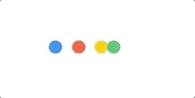
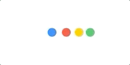

# BouncyBallsLoader
A bunch of cute little bouncing balls to enhance the loading experience of your users.:heart_eyes:

### Introduction
I'm usually on the lookout for UI inspiration on [Dribbble](https://dribbble.com/) and other design-based websites when I don't have much on my plate. I don't exactly remember where I saw this one but I think it was used on a **WordPress** dashboard. I thought it was really cool and decided to make one of my own. Not only that, I tried to make it highly configurable but I'm open to suggestions to improve it.:pen:

### What it looks like?
**Upward Bouncing** | **Downward Bouncing** | **Leftward Bouncing** | **Rightward Bouncing**
------------------- | --------------------- | --------------------- | ---------------------- 
 |  |  | 

### Configurables
1. **numberOfBalls**: Determines the number of balls that'll bounce.
2. **radius**: Radius of each ball.
3. **colors**: Color of every consecutive ball (it will take a default color if count of colors is not equal to the number of balls).
4. **direction**: Determines the bounce direction (options are up, down, left and right).
5. **duration**: Total animation duration of one bounce cycle.
6. **autoLoad**: Determines if the loader will start animating as soon as it's added to the parent view (default value is set to true).

### How to use
```
// initialize properties
let loaderProperties: BouncyBallsLoader.Properties = .init(
    numberOfBalls: 4,
    radius: 8,
    colors: [.systemBlue, .systemRed, .systemYellow, .systemGreen],
    direction: .up,
    duration: 0.5
)

// initialize loader
let loader: BouncyBallsLoader = .init(properties: loaderProperties)

// add loader and set constraints
view.addSubview(loader)
loader.centerXAnchor.constraint(equalTo: view.centerXAnchor).isActive = true
loader.centerYAnchor.constraint(equalTo: view.centerYAnchor).isActive = true
loader.widthAnchor.constraint(equalToConstant: loader.optimalSize.width).isActive = true
loader.heightAnchor.constraint(equalToConstant: loader.optimalSize.height).isActive = true
```
That's it! It is **recommended** to use **optimalSize** property to set proper constraints for the loader, however, it'll also work fine if you set a custom width and height as long as it doesn't ruin aesthetics.:wink:

You need to explicity call `loader.startLoading()` if **autoLoad** is set to false. To stop the loading animation, just call `loader.stopLoading()`.

### Show some appreciation
Hey if you like this project and consider using it in your app, I'd like if you give it a star and show some love.:star::heavy_heart_exclamation:
